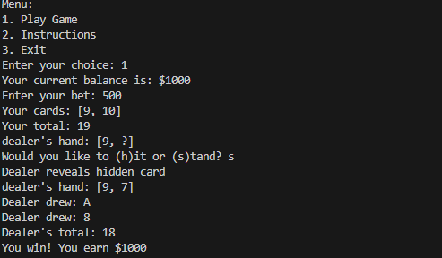

# Console-Based Blackjack Game

A Java implementation of the classic casino card game Blackjack. Players can bet virtual money, play against a dealer, and even have the option to borrow money when they run out of funds.

## Screenshot



## Features

- Virtual betting system with initial $1000 balance
- Realistic card dealing and game mechanics
- Borrowing system (up to $1000) when player runs out of money
- Automatic debt repayment from winnings
- Proper handling of Aces (1 or 11)
- Blackjack detection and special payouts

## How to Play

1. Start with $1000 initial balance
2. Place your bet (must be within your available balance)
3. Receive two cards, while dealer gets one face-up and one face-down card
4. Choose to:
   - Hit (draw another card)
   - Stand (keep current hand)
5. Try to get closer to 21 than the dealer without going over

### Special Rules

- Blackjack (21 with first two cards) pays 3:1
- Regular wins pay 2:1
- Ties return your original bet
- Aces count as 1 or 11 automatically

## Running the Game

```bash
javac Main.java
java Main
```

## Game Controls

- Enter bet amount using numbers
- Use 'h' for hit
- Use 's' for stand
- Select menu options using numbers 1-3

## Borrowing System

If you lose all your money, you can:
- Borrow up to $1000
- Future winnings automatically repay the debt
- Game ends if you lose all borrowed money
